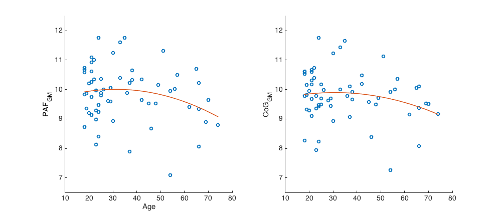
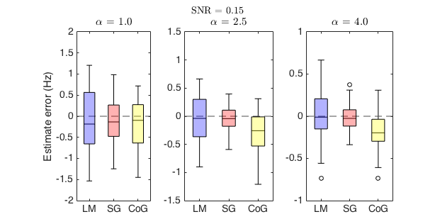

**Keywords**: Alpha; Individual alpha frequency; Peak frequency; Centre of gravity; Posterior dominant rhythm; Savitzky-Golay filter

^a^Cognition & Philosophy Laboratory, School of Philosophical, Historical and International Studies, Monash University, Clayton, VIC 3800, Australia

^b^Cognitive Neuroscience Laboratory, School of Psychology, Social Work and Social Policy, University of South Australia, Magill, SA 5072, Australia

^c^Max Planck Institute for Psycholinguistics, Nijmegen, 6500 AH, The Netherlands

^\*^**Corresponding author at**: Cognition & Philosophy Laboratory, Room E672, Menzies Building, 20 Chancellors Walk, Monash University, VIC 3800, Australia

E-mail address: andrew.corcoran1\@monash.edu

**Conflicts of interest**: None. 

**Role of funding source**: This work was partially supported by funding from the University of South Australia Ehrenberg-Bass Institute for Marketing Science. This funding supported the first author while he collected and analysed the empirical EEG dataset reported in this manuscript. The Institute had no influence on the design, analysis, or interpretation of the reported study.

# Introduction
Oscillatory activity is an inherent property of neurons and neuronal assemblies, and the timing of oscillatory dynamics is thought to encode information [e.g. @buzsaki2004;@fries2005;@vanrullen2016].
Neuronal oscillations reflect fluctuations between states of high and low receptivity, such that communication between individual neurons and broader neuronal populations is optimised via the establishment of oscillatory coherence [@fries2005;@fries2015].
Complex cognitive tasks typically require coordination between distant brain regions and systems, thus requiring effective connectivity to be established within task-relevant neural networks at relatively short timescales [@fries2005;@palva2011].
Task-irrelevant and potentially interfering connections must concomitantly be inhibited, i.e. task-relevant neural networks are gated by inhibition [@jensen2010].
The alpha rhythm of the human EEG is thought be the primary carrier of this inhibitory function [@klimesch2007;@klimesch2012;@jensen2010;@jensen2012;@sadaghiani2016], with alpha synchronisation in task-irrelevant regions reflecting inhibition, and alpha desynchronisation in task-relevant regions reflecting release from inhibition [@pfurtscheller2003].
This account is gaining increasing acceptance over alternative accounts of the alpha rhythm such as the proposal that it reflects cognitive idling [@adrian1934;@pfurtscheller1996].

While the importance of the alpha rhythm for cognitive processing has been recognised since Hans Berger's seminal work on the human EEG in the early 20th century [@berger1929; cf. @adrian1934], a more recent line of research has focused on the importance of interindividual variability in resting alpha activity for cognitive processing [cf. @klimesch1999, for a review].
According to this body of literature, the frequency at which alpha-generating neural circuits predominantly oscillate during relaxed wakefulness (i.e. the individual alpha frequency; IAF) predicts performance across a variety of perceptual [e.g., @cecere2015;@samaha2015] and cognitive [e.g., @bornkessel2004;@clark2004;@klimesch2006] tasks.
IAF is a trait-like characteristic of the human EEG [@grandy2013a], which shows high heritability [@lykken1974;@malone2014;@posthuma2001;@smit2006] and test-retest reliability [@gasser1985;@kondacs1999;@naepflin2007], while remaining stable across cognitive training interventions [@grandy2013a].
Individuals with a low IAF process information more slowly [@klimesch1996b;@surwillo1961;@surwillo1963], and show reduced performance on memory tasks [@klimesch1999] and general intelligence measures [*g*; @grandy2013] in comparison to their high-IAF counterparts.
IAF decreases with age from young adulthood onwards [@chiang2011;@klimesch1999;@kopruner1984;@obrist1979], hence lifelong changes in IAF accompany the well-known decline of many cognitive abilities in older adulthood [e.g. @hedden2004;@salthouse2011].
Taken together, this evidence suggests that IAF constitutes a promising neurophysiological marker of certain fundamental properties of central nervous system information processing [@grandy2013;@grandy2013a].

In addition to accounting for interindividual variation in alpha-band oscillatory dynamics, tuning the definition of individual frequency bands in accordance with the IAF may help to sharpen the precision of frequency domain analyses more broadly [@klimesch2012].
Taking the IAF as an anchor point that separates subregions of the alpha band has helped to reveal functional dissociations between distinct alpha-rhythms [@klimesch1997], and offers an empirically-driven approach for the localisation of canonical frequency bands [@klimesch2012].
Despite the apparent advantages of IAF-guided frequency domain analysis, however, no consensus currently exists as to the optimal method for quantifying IAF.
This paper thus sets out to develop a rigorous, automated strategy for estimating two of the most widely reported indices in the IAF literature; namely, peak alpha frequency and alpha frequency centre of gravity.
We begin by surveying various ways in which these measures have been operationalised and implemented in previous research, and highlight some of the problematic aspects of these approaches.

## Peak alpha frequency
The classical method of estimating IAF relies on delineating the peak alpha frequency (PAF); a singular, prominent peak within the alpha-band frequency range [8-13 Hz; @noachtar2004] of the power spectral density (PSD) plot (see [Figure 1](#pafs)).
This expression can be formalised in terms of the local (i.e. relative) maximum within the alpha band:

$$ \text{PAF} =  
\begin{cases}
\text{arg}\max_{f \in  \text{alpha band}} \text{PSD}(f), & \text{PSD}(f) - \text{PSD}(f') \geq \varphi \, \forall f' \neq f \\
\text{undefined}, & \text{otherwise}
\end{cases}
$$

where $\text{arg} \max$ returns the frequency bin (or subset of bins) $f$ containing the maximal power value $\max \text{PSD}(f)$ registered within the set of frequency bins constituting the alpha band.
Note that, for the output of $\text{arg max}$ to qualify as an estimate of PAF, it must return a single frequency bin $f$  with a corresponding power spectral density $\geq \varphi$, where $\varphi$ defines the minimum threshold value differentiating a substantive spectral peak from background noise.
The definition of both the alpha band interval and $\varphi$, the discrimination threshold, pose non-trivial problems (more on which shortly).

![Power spectral density (PSD) plots displaying frequency component distribution of averaged signal variance across a 2 min eyes-closed resting-state EEG recording (POz). Light grey column indicates the standard alpha band interval [8-13 Hz; @noachtar2004], which constitutes the search window for the peak frequency. *Left panel*: Linear-scaled PSD ranging from 1 to 25 Hz. Strong alpha band activity is clearly evidenced by the sharp component spanning ~7.5 to 12.5 Hz, and peaking at ~9.75 Hz. *Central panel*: Alternative depiction of the PSD displayed in the left panel. Here, the y-axis is presented  log-transformed into decibels. Decibel-scaling accentuates the relatively minor peak detected in the beta range of the spectrum (this activity approximates the first harmonic of the dominant alpha rhythm). *Right panel*: Log-log plot of spectral density estimates across all frequency bins resolved within the range of 1 to 100 Hz (frequencies and power estimates both log-transformed). The alpha peak represents a marked deviation from the $1/f$ inverse power-law (indicated by the broken line) characteristically approximated by log-transformed EEG power spectra.](figs/pafs.png){#pafs}

PAF estimates are typically extracted from parieto-occipital EEG channels while the participant relaxes with their eyes closed.
This strategy exploits the classic observation that alpha oscillations dominate EEG recorded over centro-posterior scalp regions when visual sensory input is suppressed [@barry2007;@sadaghiani2016].
Although PAF can often be rapidly ascertained upon visual inspection of the PSD function ([Figure 1](#pafs)), this approach to IAF extraction is inefficient and potentially impractical when dealing with large datasets [@chiang2008;@goljahani2012].
Moreover, it is well documented that a sizeable proportion of individuals fail to manifest an unambiguous PAF, on account of there being either two (or more) peaks within the alpha band [so-called 'split-peaks'; @chiang2011], or a general absence of prominent alpha-band activity [e.g., @anokhin1996] (see [Figure 2](#bad_pafs)).
Under such circumstances, visual analysis of the PSD plot must determine whether a PAF estimate can be reliably inferred.
Relating back to the PAF formulation outlined above, these scenarios can be construed as the problem of evaluating whether the $\varphi$ criterion has been satisfied (or alternatively, of determining the correct threshold level where this criterion ought to be located).
Resolving such problem cases (i.e. deciding whether a single, dominant peak can be confidently distinguished from competing peak candidates / noise fluctuations in background spectral activity) necessarily involves subjective choices on the part of the investigator.
Such cases may consequently be prone to biased or inconsistent assessment [@chiang2008] and pose significant challenges to replicability.
Uncertainty about the appropriate decision rule for ambiguous spectral peaks can also result in the exclusion of a substantial subset of participants from IAF-related analyses [see for example, @bornkessel-schlesewsky2015].

{#bad_pafs}

Automated analysis routines offer one way of ensuring that PAF criteria are explicitly stipulated and consistently applied within and across datasets.
However, while simple automated peak detection methods are relatively straightforward to implement in many popular EEG processing software packages, such strategies are prone to various sources of error.
For instance, searching for the maximal power estimate $\max \text{PSD}(f)$ within the alpha-band search window  can result in the arbitrary assignment of PAF at the lower edge of the search window in the absence of a clear peak.
That is, in the case where the PSD function declines approximately monotonically [e.g., conforms to the $1/f$-like power distribution without showing any clear deviation within the alpha range; cf. @pritchard1992], the highest power value within the alpha band will be the supremum encountered at the first frequency bin included within the alpha-band interval.
One solution to this problem is to stipulate that $\text{arg} \max \text{PSD}(f)$ qualifies as a viable PAF estimate if and only if the power estimate of frequency bin $f_k$ exceeds that of its neighbouring frequency bins $f_{k-1}$ and $f_{k+1}$.
While this approach ensures that the selected frequency component constitutes a local maximum rather than a supremum, it is still vulnerable to two of the problems identified above.
First, it fails to distinguish spectra featuring singular, dominant peaks from those possessing prominent secondary peaks (i.e. where visual inspection of the plot would suggest two or more alpha peaks that differ by some -- potentially trivial -- magnitude; e.g., left and central panels, [Figure 2](#bad_pafs)).
Second, it fails to differentiate maximum power values at the apex of a genuine spectral peak from those at the apex of noisy fluctuations within the PSD function (i.e. where visual inspection of the plot would suggest the absence of any substantive alpha peak; e.g., right panel, [Figure 2](#bad_pafs)).
Automated routines of this sort might therefore render rapid and consistent estimates of PAF, but are likely to be too liberal in what they accept as an alpha peak.

## Alpha centre of gravity and individualised frequency bands
Klimesch and colleagues [@klimesch1993; @klimesch1997] proposed using the PSD-weighted mean alpha frequency [i.e. alpha centre of gravity (CoG); @klimesch1990], in order to circumvent some of the difficulties posed by the absence of a clear spectral peak.
Mathematically, we can express the COG as

$$ \text{CoG} = \frac{\int_{f_1}^{f_2} \text{PSD}(f) \cdot f \; df}{\int_{f_1}^{f_2} \text{PSD}(f) \; df}. $$

Since the CoG is sensitive to the shape of the power distribution within the selected alpha-band window, and the precise bandwidth of alpha-rhythm activity varies across individuals, Klimesch and colleagues [-@klimesch1990, see also @klimesch1997] discouraged calculating the CoG according to a fixed index of summation corresponding to some standard, a priori-defined alpha bandwidth (e.g., $f_1$ = 8 Hz, $f_2$ = 13 Hz).
Rather, they recommended computing CoG on the basis of bespoke frequency windows that capture the entire range of the individual's alpha-band activity.
To this end, Klimesch and colleagues [-@klimesch1990] proposed the following procedure for estimating the IAF bandwidth:
First, PSD plots are extracted from all EEG channels for each participant and examined for evidence of a clear alpha peak.
Second, $f_1$ and $f_2$ are assigned to those frequency bins where the ascending and descending edges of the peak are deemed to start and end, respectively [[Figure 3](#f1f2); cf. Table 1, @klimesch1997].
Finally, these channel-wise $f_1$ and $f_2$ values are averaged to render the bounds of the frequency interval (i.e. individualised alpha-band window) that will be used to calculate the participant's CoG.
Notice that, although EEG channels which fail to manifest distinctive peaks do not contribute to the calculation of the IAF bandwidth, CoG is computed on the basis of spectral data compiled from the frequency bins bounded by $f_1$ and $f_2$ across all available channels.

![Fixed vs. individually adapted alpha frequency band windows. *Left panel*: Individual bandwidth (indicated by shaded area under PSD) closely approximates the standard alpha-band range indicated by the grey column. *Central panel*: Fixed bandwidths may fail to fully (and selectively) capture empirical alpha peak distributions, thus giving rise to biased estimates of alpha centre of gravity. *Right panel*: Spectral density from central panel reproduced with superposed eyes-open resting-state PSD (red function). Here, the transition frequency (TF) at which the ascending edge of the eyes-closed alpha peak intersects with (and surpasses) the corresponding eyes-open power estimates (indicated by the broken black line) closely approximates the lower bound of the alpha interval $f_1$ located via qualitative analysis of the plot. In this case, the empirical TF (6.5 Hz) deviates from standard definitions of the theta/alpha boundary, locating the beginning of the alpha component within what would canonically be considered as the theta band (indicated by the pink column). Power estimates log-scaled to aid visual identification of $f_1$ and $f_2$ [@klimesch1997].](figs/f1f2.png){#f1f2}

Klimesch [-@klimesch1999] later proposed an alternative method for defining individualised alpha-band windows that relies on a somewhat less subjective interpretation of the PSD.
This technique exploits the typically observed anticorrelation between theta- [4–8 Hz; @noachtar2004] and alpha-band oscillatory dynamics in response to task demands or cognitive load [@doppelmayr1998a; @klimesch1996a; cf. @rugg1982].
Klimesch and colleagues [-@klimesch1996a] first used this approach to delineate the 'transition frequency' (TF) where the alpha-band activity that dominates the relaxed individual's EEG gives way to theta oscillations induced by stimulus processing (see [Figure 3](#f1f2), right panel).
Adopting an event-related desynchronisation [ERD; @pfurtscheller1977; @pfurtscheller1999] paradigm, spectra from a pre-stimulus 'reference' interval and a peri-stimulus 'test' interval were averaged across trials and superposed, and the TF designated as the frequency at which the reference and test interval PSD functions intersected (or where the difference between them was minimised, in cases where they failed to intersect).
Klimesch [-@klimesch1999] proposed generalising this procedure to resting-state EEG recordings, where an analogous shift from prominent alpha- to theta-band activity is classically evoked by the visual stimulation experienced upon opening the eyes [this phenomenon, known variously as alpha blocking, desynchronisation, suppression, or attenuation, was first documented by @berger1929].
This method thus renders a systematic means of estimating the lower alpha frequency bound $f_1$.

In the absence of any analogous means of inferring the upper bound of the alpha-band window, Klimesch [-@klimesch1999] recommended determining $f_2$ on the basis of $f_1$ and the IAF (as given by the peak frequency).
One suggestion was to set $f_2$ rather pragmatically at 1 to 2 Hz above the IAF ([Figure 4](#findf2), left column).
Alternatively, $f_2$ could be derived by subtracting the difference between IAF and $f_1$ (i.e. the lower alpha band) from some presupposed alpha bandwidth, and treating the remainder as the span of the upper alpha band.
For instance, if the alpha interval is assumed to span 5 Hz [@klimesch1999], and the PSD manifests a TF of 7 Hz and an IAF of 10.5 Hz, then $f_2 = 5 - (10.5 - 7) + 10.5 = 12$ Hz ([Figure 4](#findf2), central column).
Although these approaches do indeed adjust the value of $f_2$ in relation to the IAF, they are insensitive to interindividual differences in alpha bandwidth [@doppelmayr1998; @goljahani2012].
A more promising solution that attempts to capture such variance is given by calculating $f_2$ as a proportion of the difference between IAF and $f_1$ [@doppelmayr1998;@klimesch1999]; e.g., $f_2 = ( (IAF - f_1) / 2 ) + IAF$ ([Figure 4](#findf2), right column).
While this heuristic offers a more nuanced approach towards individually adapted estimates of $f_2$, it clearly depends on the assumption that the proportional difference between the IAF and the alpha bandwidth is consistent across individuals (such that the lower alpha band spans approximately double the frequency range of the upper alpha band).
Furthermore, all of these methods presuppose that IAF has already been estimated via the PAF (since CoG cannot be calculated prior to the definition of $f_1$ and $f_2$).
This is obviously problematic given that one of the chief advantages of the CoG is its supposed capacity to deliver IAF estimates when the PAF is unavailable.

. In each case, $f_1$ (left-most broken line) is defined according to the transition frequency (TF), and IAF (solid line) is defined according to the peak frequency. *Top row*: Defining $f_2$ as $IAF + 2$ Hz (left panel) and $IAF + ((IAF - TF)/2)$ (right panel) render similar results, closely approximating the boundary located by visual inspection. However, defining $f_2$ as the residual of a fixed bandwidth (5 Hz) following subtraction of the lower alpha band (blue shading) fails, almost collapsing $f_2$ into the IAF on account of the broadness of the lower alpha band (centre panel). *Bottom row*: All three methods return similar estimates of $f_2$ when the lower alpha region conforms to the 3.5-4 Hz bandwidth assumed by Klimesch [-@klimesch1999]. In each case, the estimated span of the upper alpha band region (pink shading) is suboptimally narrow.](figs/findf2.png){#findf2}

## Peak attenuation and channel reactivity based (CRB) methods
We turn now to two interesting extensions of the TF approach that depend on the alpha blocking or desynchronisation phenomenon mentioned above.
The first method, which we refer to as peak attenuation, was described by Posthuma, Neale, Boomsma, and de Geus [-@posthuma2001].

Similar in principle to Klimesch's [-@klimesch1999] delineation of the TF, the peak attenuation technique simply subtracts eyes-oped PSD estimates from the corresponding ordinates of the eyes-closed PSD within some a priori-defined target region (typically, this interval is somewhat broader than the canonical alpha bandwidth; e.g., 7–14 Hz).
The resulting peak, which constitutes the maximal power difference between the two spectra, is taken as the PAF ([Figure 5](#blocking), top row).
To avoid trivial peaks arising from small fluctuations in the PSD, Posthuma and colleagues [-@posthuma2001] excluded spectra that featured consistent low power (< 1.5 $\mu$V^2^/Hz) within the alpha-band.
It isn't clear, however, whether this criterion (which is analogous to the $\varphi$ parameter in the PAF equation defined in Section 1.1) was also applied in cases where the maximal difference between spectra was similarly small (i.e. where both spectra present a substantive, approximately overlapping alpha-band component).
Posthuma and colleagues [-@posthuma2001] also remarked that peak attenuation estimates deviated from eyes-closed resting-state PAFs in 21% of cases.
This lack of convergence, coupled with the observation that peak attenuation may lead to distorted representations of the PAF when the assumption of significant eyes-open alpha desynchronisation fails to obtain [see [Figure 5](#blocking), central and bottom row; cf. @gaal2010; @kreitman1965], suggests peak attenuation may constitute a suboptimal IAF estimator (at least insofar as IAF is conceived in terms of the PAF).

![Illustration of the peak attenuation method, in which PSD estimates from a period of eyes-open EEG (EO) are subtracted from a corresponding eyes-closed recording (EC). The peak frequency of the resulting difference function (within the extended alpha band 7-14 Hz, grey column in difference spectra) is taken as the IAF estimate. *Top row*: Alpha-band activity registered during the EO recording (magenta shading) is relatively low compared to that of the EC spectrum (blue shading). In this case, the peak attenuation method returns the PAF of the EC spectrum as the IAF estimate. *Central row*: When alpha-band power is similar across EO and EC recordings, peak attenuation is vulnerable to bias. In this case, a peak at 9.75 Hz is present in both spectra, thus cancelling one another out in the difference spectrum. Peak attenuation returns 8.5 Hz as the IAF. *Bottom row*: Data from another participant in which partial overlap of EC and EO spectral components results in underestimation of the alpha peak by ~1 Hz. Here the attenuation method results in two difference peaks of near equal magnitude, one of which is arbitrarily greater than the other. Neither of these difference peaks are likely to reflect a close approximation of the underlying IAF.](figs/blocking.png){#blocking width=75%}

Although Posthuma and colleagues [-@posthuma2001] did not attempt to locate the bounds of the individual alpha bandwidth on the basis of peak attenuation, the logic motivating this technique could be applied to infer $f_1$ and $f_2$ in much the same way as the TF (i.e. by taking those frequency bins either side of the difference peak where the difference between corresponding spectral estimates is *minimised*).
This is precisely the approach that Goljahani and colleagues formalised in their channel reactivity based (CRB) method [@goljahani2012; @goljahani2014].
This technique, which is conceptually reminiscent of Klimesch and colleagues' [-@klimesch1996a] attempt to characterise phasic shifts in band power, quantifies the difference between reference and test PSDs in terms of the alpha responsiveness (or desynchronisation) region; i.e. the area between the PSD functions spanning frequency bins $f_1...f_2$ (where the spectra intersect, or the residual difference between corresponding spectral estimates is minimised).
IAF is estimated by computing the CoG for the reference interval, taking the frequency bounds delimiting the responsiveness region as the index of summation.

The CRB method offers an elegant solution to the problem of finding individualised frequency bands for CoG estimation.
Not only does it improve on previous attempts to characterise the bounds of the alpha range by means of a rapid, automated, and empirically driven appraisal of reference vs. test interval PSD functions, it does so without any assumptions about (or dependence on) the peak-like quality of the spectra.
As such, CRB promises to maximise the potential utility of the CoG as an estimator of IAF that can be reliably computed irrespective of the presence or absence of a single, distinct peak component.
We note however that, much like the peak attenuation technique, CRB estimates may be prone to bias in cases where the ERD task elicits asymmetrical patterns of alpha-band desynchronisation (Klimesch et al., 1996b; see also Klimesch, 1997, for evidence of the dissociation between lower and upper alpha-band reactivity).
This is because the partial overlap of reference and test spectra that will ensue should the test stimulus fail to evoke comprehensive alpha desynchronisation will restrict the responsiveness region to a limited segment of the alpha band, thus precipitating a narrower (and potentially shifted) index of summation.
Indeed, this phenomenon might go some way to explaining the substantial discrepancies observed between some of the CRB CoG estimates reported by Goljahani and colleagues (some of which were extreme by conventional IAF standards; e.g., 14.9 Hz) and the corresponding PAFs derived from the same set of channel data [see Figure 6(d), @goljahani2012].

A related concern deriving from the CRB method's reliance on phasic changes in rhythmic activity is the possibility that within-subject estimates of IAF might vary depending on the specific processing mode evoked by the event (e.g., target discrimination vs. memory retrieval; visual vs. auditory modality), and the relative timing of the reference/test intervals subjected to spectral analysis.
ERD studies have revealed that both the qualitative profile and temporal course of alpha- and theta-band desynchronisation are contingent upon the particular nature of the task used to induce oscillatory power shifts [@klimesch2006; @klimesch2007].
If different paradigms do precipitate distinct patterns of ERD during the selected test interval [or indeed, *enhance* rather than attenuate the alpha rhythm; e.g., @kreitman1965; @rihs2007], then the ensuing responsiveness regions used to define the coverage of the CoG estimate will span non-identical frequency bands [cf. @haegens2014, for evidence of analogous intraindividual shifts in PAF as a function of varying task conditions].
This property of the CRB method need not be a problem for ERD-type applications – indeed, sensitivity to such selective changes in band power might prove theoretically interesting and productive in this context (cf. Jensen & Mazaheri, 2010; Klimesch, 2012, for reviews of alpha ERD/ERS changes related to specific task demands).
However, it renders the approach less suited to the task of estimating the IAF as a marker of stable, trait-like differences in information processing capacities.

## Automated curve-fitting approaches to alpha rhythm quantification
Finally, we turn briefly to a promising line of research that attempts to quantify the spectral features of EEG data, and in particular spectral peaks, by means of statistical curve-fitting techniques.
Chiang and colleagues [-@chiang2008] developed an algorithm (with corresponding implementation in C) that parameterises alpha-band peaks via a two-step procedure: Peaks are first identified and parameterised via the fitting of a Gaussian function, before being fine-tuned in relation to the spread of fitted estimates across multiple electrode sites.
Chiang and colleagues [-@chiang2011] and van Albada and Robinson [-@van_albada2013] later demonstrated the potential utility of such automated routines by applying this general technique to datasets comprising 1498 and 1424 individuals, respectively.
Another automated spectral analysis technique that similarly instantiates an iterative curve-fitting and clustering procedure was proposed by Lodder and van Putten [-@lodder2011;-@lodder2013].
This technique has likewise been applied to a large dataset comprising resting-state EEG recordings from 1215 individuals [@lodder2011], where it produced estimates that were highly correlated with previously documented visual estimates of PAF (on average, visual and automated estimates differed by 0.52 Hz).
Lodder and van Putten reported that higher degrees of estimate accuracy (i.e. agreement with visually scored PAFs) could be achieved by eliminating low-certainty estimates, although at its extreme this strategy resulted in a substantial rate of attrition (41% of estimates discarded).

Given the obvious advantages of automated analysis tools, it is somewhat puzzling that these curve-fitting techniques do not yet appear to have gained widespread currency in the contemporary IAF literature [although cf. Haegens and colleagues, -@haegens2014, for a notable counterexample].
For instance, neither Goljahani and colleagues [-@goljahani2012] nor Bazanova and Vernon [-@bazanova2014] mention the development of such algorithms in their reviews of IAF methods.
One possibility is that many investigators are simply unaware of the existence of these methods, since their application to date has been predominantly focused on spectral modelling, rather than the quantification of IAF per se.
An alternative explanation is that investigators deem these methods too complex to be a worthwhile investment of their time (especially if quantifying IAF is only an intermediary step within a broader analysis framework, rather than the main topic of inquiry).
This attitude might be reinforced by the additional burden involved in obtaining and implementing an algorithm that may have been written in an unfamiliar programming language, and which poses nontrivial challenges with respect to integration with existing analysis pipelines.
We suggest then that one of the critical steps towards achieving a more widespread adoption of automated IAF estimation routines is to make these tools as openly available as possible, in formats that are easy to assimilate within popular methods of EEG data analysis.

## Aims of the present study
In sum, common methodological approaches to IAF estimation are either (1) time-consuming and vulnerable to inconsistencies arising from qualitative interpretation, (2) at risk of producing spurious or biased estimates under certain plausible spectral conditions, (3) conflate trait-like alpha properties with variable phasic effects, or (4) some combination of the above.
More recent innovations designed to address these problems via the application of sophisticated curve-fitting algorithms have so far found limited uptake within the broader IAF literature, perhaps on account of practical barriers pertaining to software access and implementation.
Consequently, we sought to articulate an automated method of alpha-band quantification that provides fast, reliable, and easily replicated estimates of resting-state IAF in two major programming languages: MATLAB^&reg;^ (The MathWorks, Inc., Natick, MA, USA) and Python&trade;.
This goal is consistent with recent proposals to make the analysis of cognitive electrophysiological data as open, transparent, and amenable to replication as possible [@cohen2017].

Our approach aims to emulate Klimesch and colleagues' [-@klimesch1990] original attempt to characterise individual profiles of resting-state oscillatory activity across the entirety of the alpha band by means of a relatively simple, non-parametric curve-fitting algorithm.
Our strategy for accomplishing this task runs as follows:
First, we extract PSD estimates from preprocessed and fast Fourier transformed EEG signals.
Second, we apply a least-squares curve-fitting procedure (i.e. Savitzky-Golay filtering) to accomplish the dual task of smoothing the PSD function and estimating its first- and second-order derivatives.
Third, these derivative functions are analysed to evaluate the quality of evidence that a distinct spectral peak (i.e. PAF) exists within the alpha frequency region.
Finally, the first derivative of the PSD is reanalysed to delineate upper and lower bounds of the individualised alpha-band window, which are taken as the index of summation required to calculate the CoG.
The effectiveness of this routine will first be demonstrated using empirical (i.e. non-simulated) EEG data.
We will then turn to simulated data in order to assess how well our proposed technique performs under conditions of varied spectral composition and signal-to-noise ratio (SNR).

# Method

## Overview of methodological approach: Differentiation as a means of spectral peak quantification
In the following section, we show how differential calculus can be exploited for the purposes of alpha peak parameterisation.
First, we outline how spectral peaks (and troughs) can be localised via the first-derivative test.
We then address the problem of multiple (potentially trivial) zero crossings, and propose Savitzky-Golay filtering as an elegant solution to this concern.
Finally, we turn to the second derivative in order to arrive at a means of evaluating the relative quality of individual channel peak estimates.

### Local extrema and first derivative zero crossings
As pointed out by Grandy and colleagues [-@grandy2013; -@grandy2013a], one solution to the problem of automated peak detection is to search for downward going zero crossings in the first derivative of the PSD.
Derivatives describe the relative rate of change in the dependent variable or function $f(x)$ given some value of the independent variable $x$.
The first derivative of a vector of PSD estimates thus provides point estimates of the (instantaneous) rate of change in the amount of spectral power estimated for each frequency bin resolved in the analysis.
This relationship can be formalised as follows:

$$ f'(x) = \lim_{ \Delta{x} \rightarrow{} 0} \frac{\Delta f(x)} {\Delta x} , $$

where $f'(x)$ is the first derivative of the relative change in the power estimate $f(x)$ at frequency bin $x$.

Another way to conceptualise this relationship is to construe the derivative as describing the slope of the tangent line to the PSD function $f(x)$ at any given frequency bin $x$.
From this perspective, it becomes clear that the first derivative will be zero (i.e. the slope of the tangent will be horizontal) at any point in the function corresponding to a peak or trough.
In the case of the former, the derivative will change from a positive value (as the function ascends towards its peak) to a negative value (once the function begins to descend) as the tangent traverses the local maximum.
As such, positive to negative sign changes (i.e. downward going zero crossings) within the first derivative offer a convenient index of local maxima.
Conversely, sign changes in the opposite direction (i.e. upward going zero crossings) can likewise be used to identify local minima.^[A lack of sign change, e.g., a positive derivative going to zero then becoming strictly positive again, corresponds to a plateau.]

### Savitzky-Golay smoothing and differentiation
Although Grandy and colleagues [-@grandy2013; -@grandy2013a] correctly observe that searching for downward going zero crossings avoids the problem of arbitrary boundary effects in the absence of any clear alpha peak, they fail to articulate a systematic method for differentiating substantive peaks from trivial fluctuations in the PSD.
We suggest that the situation in which spectral analysis is degraded by signal noise can be substantially improved via the application of a smoothing procedure.
The idea here is to attenuate noisy fluctuations about the true alpha peak such that the vast majority of zero crossings deriving from trivial variations are eliminated from the signal.
However, since standard filtering techniques (such as the moving average) can result in marked distortions of the underlying peak structure [e.g., @press1992; @ziegler1981], the challenge is to find a smoothing operation that preserves the spectral characteristics of critical import to IAF analysis.

With this concern in mind, we turn to the Savitzky-Golay filter (SGF), a least-squares curve-fitting procedure specifically designed to aid in the detection of spectral peaks (originally in chemistry) amidst noisy conditions [@savitzky1964].
The SGF has a number of properties that make it well suited to the task of smoothing PSD functions, not least of which being its capacity to render smoothed curves that conserve the height, width, position, area, and centre of gravity of the underlying spectral structure [see @ziegler1981].
SGFs work by centring a sampling window of length $F_w$ on a portion of the input signal and computing the least-squares fit of a specified polynomial to each $i$^th^ data point spanned by $F_w$.
The window is then shifted one point along the input signal, and the polynomial fit recalculated accordingly.
The centre value of the polynomial fit is taken as the filter output at each iteration of the sliding window calculation, and these output values are concatenated to render the smoothed estimate of the input function.
For a more detailed treatment of the SGF and its technical performance properties, the interested reader is referred to Schafer [-@schafer2011].

In addition to its smoothing capability, SGFs can also be applied to calculate the $n$^th^ order derivative of the input signal.
Indeed, commensurate with their desirable spectral smoothing characteristics, SGFs are optimal (or near optimal) digital differentiators [@luo2005].
The performance features thus qualify the SGF as a valuable tool for both (1) refining the precision of standard methods used to characterise the spectral profile of alpha-band rhythms, and (2) improving the reliability of first derivative zero crossing approaches to spectral peak (and trough) localisation.
Before describing how the dual function of the SGF can be implemented for the purpose of IAF analysis, however, we turn to one final innovation involving the second derivative.

### Assessment of peak quality
Typically, resting-state EEG recordings afford data from multiple electrode channels, a selection of which may contribute to the final estimate of the IAF.
Channels that are in close proximity to one another are expected to produce highly correlated data; hence, a set of channels concentrated on the centro-posterior region of the scalp should ideally render highly convergent estimates of spectral power.
However, since channels may be differentially affected by various sources of signal noise (e.g., high or fluctuating levels of impedance between scalp and electrode), SNR might be degraded in analyses that treat all data sources uniformly.
We therefore propose an automated method of peak analysis that seeks to evaluate which channels provide the strongest evidence of a prominent alpha peak, so that these channels can be assigned heavier weights for cross-channel averaging.
This procedure is intended to sharpen the precision of PAF estimation amidst cross-channel PSD variability without resorting to the exclusion of channels that are less conformant to the conceptual ideal of a high powered, narrowly defined spectral peak.

This approach relies on differentiation of the second derivative of the PSD function:

$$ f''(x) = \lim_{ \Delta{x} \rightarrow{} 0}  \frac {\Delta f'(x)} {\Delta x} , $$

where $f''(x)$ is the derivative of the first derivative $f'(x)$ at frequency bin $x$.
In other words, the second derivative is simply the rate of change of the first derivative of some function $f(x)$.
Second derivatives are useful for evaluating whether the curvature of a function is concave up (i.e. convex) or concave down at any given value of $x$.
The transition of a curve's direction between concave up and concave down is characterised by an inflection point, which registers a second derivative value of zero.

We suggest that the inflection points $i_1$ and $i_2$ on either side of $\text{max } f(x)$ offer a convenient objective standard for evaluating the relative quality of channel peak estimates.
The basic idea here is to quantify the area under the peak in such a way that distinguishes stronger (i.e. containing a greater proportion of spectral power) and less variable (i.e. spanning fewer frequency bins) peaks from shallower, broader, or otherwise noisier components.
Given a set of spectral data from a variety of electrode channels, those PSDs which give rise to higher quality peaks (as operationalised above) are weighted more heavily than their less prominent counterparts, and thus contribute relatively more information when calculating the cross-channel PAF estimate.
Note that this procedure has no bearing on CoG estimation (since the CoG may be derived from spectra in which no clear evidence of a single alpha peak was detected, and thus for which no inflection point data will be available).

Having defined both the height and width of the putative alpha peak by means of the first and second derivative zero crossings, peak quality is quantified via the following formula:

$$ Q = \frac{\int_{i_1}^{i_2} \text{PSD}(f)\; df } { i_2 - i_1 } , $$

where $Q$ is the scaled average power within the peak interval $[i_1,i_2]$.
^[Notice that the interval bounded by $[i_1,i_2]$ is distinct from that bounded by $[f_1,f_2]$, the estimated span of the individualised alpha-band window.
The former yields a narrower frequency range than the latter, and does not take into account secondary peaks within the alpha band.]
(In a very strict sense, $Q$ is the mean value of the power spectral density function on the peak interval as given by the Mean Value Theorem.)
Note that the inclusion of the denominator ensures that spectral width is taken into account when calculating $Q$.  
Given equal values of $\int_{i_1}^{i_2}\text{PSD}(f)$, the denominator adjusts the integrand such that narrower, sharper peaks are assigned a larger $Q$ value than their broader, flatter counterparts.
This formulation thus penalises 'less peaky' components by assigning a heavier weighting to those estimates containing evidence of a relatively more dominant spectral peak (see [Figure 6](#q_wts)).
However, it is perhaps worth emphasising that this calculation only influences PAF estimation in cases where channel data produce divergent PAF estimates (i.e. channel estimate $Q$ weights have no impact on the mean PAF calculated from channels that furnish identical estimates of the peak frequency).

![Power spectra from four individuals in which two channels from the same eyes-closed resting-state recording are superposed. Each spectrum is shaded within the region bounded by the inflection points either side of the  peak alpha frequency estimate. Respective $Q$ values are also presented. *Left column*: Blue channel peaks dominate their red counterparts, however cross-channel averages are unaffected due to the identity of peak estimates. *Right column*: Where peak estimates diverge across spectra, channels which manifest a greater concentration of power (holding peak width constant) will be assigned higher weightings compared to those with relatively less power. Note that secondary components are ignored on account of the inflection point delimitation of the main peak. Power values normalised within each channel according to mean spectral power. *a.u.*: arbitrary unit.](figs/q_wts.png){#q_wts width=75%}

##Implementation

### Software requirements
The afore-described approach to IAF estimation has been implemented via a set of customised functions programmed in MATLAB and Python.
The following report focusses on the MATLAB implementation of the programme, which is dependent upon the Signal Processing Toolbox&trade; and the EEGLAB toolbox [@delorme2004].
EEGLAB is necessary for data importation, since our analysis programme assumes that EEG data are structured according to EEGLAB conventions.
Signal Processing Toolbox is required for the `pwelch` and `sgolay` functions, which are responsible for executing the PSD estimation and SGF design components of the programme, respectively.
`sgolay` was preferred over `sgolayfilt` on the basis that it outputs the coefficients necessary for calculating higher-order derivative functions, as well as those required for the zero-order (i.e. smoothed) PSD function.
All functions that were developed in order to conduct the following analyses are open source and can be accessed (along with sample datasets) via [GitHub](https://github.com/corcorana/restingIAF).

We chose to base our IAF estimation strategy on a Hamming-windowed implementation of Welch's modified periodogram method of PSD estimation [@welch1967] on account of the prevalent application of this technique in the IAF literature.
It should be noted however that our approach could quite readily be modified to enable the `pwelch` routine to be substituted with some alternative method of PSD estimation.
We also stress that our selection of the Hamming window to taper time series data prior to FFT does not reflect any strong commitments concerning the optimal method of preparing EEG data for spectral analysis.
It stands rather as one common preference amongst several possible alternatives, each of which could reasonably have been applied.
Indeed, while a rigorous comparison of how our IAF estimation technique performs in conjunction with various PSD estimation methods would be desirable, it is beyond the scope of this paper.
Our focus here, rather, is to provide a convincing proof of concept for the general tenets of our smoothing-differentiation approach.

### Parameters for estimating PAF and CoG
A number of parameters must be specified in order to execute the IAF estimation programme.
In relation to the SGF, both polynomial degree $k$ and a filter window frame width $F_w$ are required to define the least-squares minimisation operation.
$k$ must be $< F_w$, and $F_w$ must be odd to ensure an equal number of sample points either side of the centre coefficient.
Also note that no smoothing will occur if $k = F_w - 1$.
Although some degree of exploratory analysis may be desirable to find the optimal combination of $k$ and $F_w$ parameters for the dataset under analysis, a convenient heuristic is to set the length of $F_w$ approximately 1 to 2 times the anticipated full width at half maximum (FWHM) of the PAF component [@enke1976; @press1992].
Relatively higher $F_w$ lengths are expected to result in more aggressive smoothing of the input function [@bromba1981], and hence may be desirable in cases of noisy spectral densities.
We note however that excessively flat peaks following application of the smoothing procedure are indicative of a suboptimally large $F_w$.
We favour higher-order polynomials (e.g., $k = 5$) due to their peak-height preserving properties, but acknowledge that they might render suboptimal fits (and less smoothing) in the context of relatively broad component structures [@press1992].
This may be of particular concern for instance when dealing with elderly populations, given that spectral power (and relative peak dominance) is typically diminished in older adults [e.g., @chiang2011; @dustman1999].

Additional parameters include:

- $W_\alpha$, the domain of the PSD searched for evidence of peak activity (corresponds to the putative alpha bandwidth);
- $minP$, the minimum quantity of normalised power required to qualify as a potential PAF candidate (determined in relation to the statistical properties of the individual spectrum);
- $pDiff$, the minimum proportion of peak height by which the highest peak component must exceed all other competitors in order to qualify as the PAF;
- $cMin$, the minimum number of channel estimates necessary for computing cross-channel averages.

Examples of what we consider to be reasonable parameter values are outlined in Section 2.3.4.

### Overview of analysis procedure
\begin{figure}
(a)
\centering
\includegraphics[width=0.7\textwidth]{figs/decision_flow1.pdf}
\caption{Flow diagrams summarising key steps of the analysis pipeline. The first diagram (a) depicts processing of individual channel data. These channel-wise estimates are then averaged according to the process described in the second diagram (b). See main text for details. {\it PSD}: power spectral density; {\it f range}: frequency bins to be included in analysis; {\it P}: spectral power estimate; {\it min}: minimal power estimate necessary for qualification as a putative peak; {\it pDiff}: minimal power difference necessary for qualification as a PAF; {\it Q weights}: quantification of peak quality; {\it cMin}: minimum number of channel estimates required for cross-channel averaging; {\it IAW}: individualised alpha-band window; $f_1$ and $f_2$: lower and upper frequency bounds of IAW; $PAF_M$: mean PAF estimate; $CoG_M$: mean CoG estimate; $IAF_M$: $PAF_M$ or $CoG_M$; $IAF_{GA}$: grand averaged PAF/CoG estimate.}
\end{figure}

\begin{figure}[t]
(b)
\centering
\includegraphics[width=0.7\textwidth]{figs/decision_flow2.pdf}
\end{figure}

The analysis process can be divided into two main phases: first, PAF and individualised alpha-band windows are estimated for each channel included in the analysis (Figure 7(a)); second, estimates are averaged across channels (and grand averaged across recordings, if possible; Figure 7(b)).

For each channel subjected to analysis, the PSD is estimated, and extraneous frequency bins beyond the span of the filter passband excluded.
Spectral data are then normalised by dividing each power estimate by the mean power of the truncated spectrum.
A log-transformed version of the PSD is derived in order to fit the regression model that will be used to estimate an upper bound on background spectral activity (i.e. $minP$).
The SGF is applied to the (nontransformed) PSD to estimate its zeroth (i.e. smoothed function), first, and second derivatives.

Initially, the first derivative is searched for downward going zero crossings within the frequency domain defined by $W_\alpha$.
If no zero crossings are identified, or if candidate zero crossings fail to exceed the corresponding  power predicted by the regression fit by more than 1 standard deviation of the estimated prediction error, the channel is excluded from further PAF-based analysis (see [Figure 8](#minPow) for example applications of this $minP$ criterion).
If more than one peak satisfies $minP$ within $W_\alpha$, these candidates are rank ordered according to their normalised power estimates, and the magnitude difference between the two largest peaks compared.
The primary peak must exceed the height of its closest competitor by more than the proportion defined by $pDiff$ in order to qualify as the channel PAF estimate.
If the primary peak satisfies this condition, the second derivative is examined to determine the location of its associated inflection points, and the $Q$ value subsequently computed.
If not, the channel is excluded from PAF analysis.

![Visualisation of smoothed power spectral density (PSD) plots with corresponding $minP$ thresholds superposed (red curve, inverse log~ transformation of 1 standard deviation about the regression fit). *Left panel*: PSD estimates for all frequency bins beyond the delta band fail to exceed $minP$; no peak registered for this channel. *Central panel*: Data from the same participant as in the left panel. In this channel, the spectral peak at ~10 Hz is sufficient to marginally exceed the $minP$ threshold. *Right panel*: Data from another participant showing a marked alpha peak that comfortably exceeds $minP$. Note differences in y-axis scaling. *a.u.*: arbitrary unit.](figs/minPow.png){#minPow}

CoG calculation follows the standard procedure described by Klimesch and colleagues [-@klimesch1990; -@klimesch1993; -@klimesch1997], with the exception that the bounds of each channel's alpha interval are detected automatically.
The analysis routine derives these bounds by taking the left- and right-most peaks within $W_\alpha$ (i.e. those peaks in the lowest and highest frequency bins, respectively; these may coincide in some cases with the PAF), and searching the first derivative for evidence of the nearest local minimum (1) prior to the left-most peak ($f_1$), and (2) following the right-most peak ($f_2$).
^[This contingency allows for the individualised alpha-band window, and thus the CoG, to be estimated even in cases where there is no clear PAF; e.g., in the presence of split-peaks.]
Since some spectra show a relatively shallow roll-off as the edges of the alpha peak diminish, and thus do not culminate in a local minimum several frequency bins away from the main body of the component structure, we relaxed the requirement for an upward going zero crossing (i.e. evidence of a local minimum) such that the transition into a prolonged shallow gradient is taken as sufficient evidence of the individual alpha bounds $f_1$ or $f_2$.
This criterion was formalised as follows:

$$f_1 = \text{arg} \max_{f < \text{PAF}} |PSD'(f)| < 1 $$
$$f_2 = \text{arg} \min_{f > \text{PAF}} |PSD'(f)| < 1 $$

$f_1$ and $f_2$ estimates from each eligible channel are averaged to yield the individualised alpha-band window.
This window defines the index of summation (i.e. frequency band coverage) used to calculate the CoG across all available channels.

If a sufficient number of channels (as stipulated by $cMin$) furnish PAF and individualised alpha window estimates, channel PAF and CoG estimates are averaged to generate IAF summary statistics (second phase of the analysis pipeline, [Figure 7](b)).
Mean PAF (PAF$_M$) is a weighted average that takes into account the $Q$ values associated with each peak estimate:

$$ \text{PAF}_M = \frac{\sum\limits_{c=1}^C \text{PAF}_c \cdot \lambda_c} {\sum\limits_{c=1}^C \lambda_c}, $$

where $c$ identifies the channel drawn from the set of all available channels $C$, and $\lambda_c$ is the channel weighting derived by dividing $Q_c$ by the maximum $Q_c$ in $C$ (such that $\sum \lambda_c = 1$).
In contrast to PAF$_M$, all CoG channel estimates contribute equally to the calculation of mean CoG (CoG$_M$).
If there are an insufficient number of channel estimates to satisfy $cMin$, no PAF$_M$ or CoG$_M$ estimates are returned (in some cases, $cMin$ will be satisfied for CoG$_M$, but not PAF$_M$, on account of the latter's more stringent criteria).

Given that resting-state EEG is often recorded both before and after an experimental session, we also included the facility to compute repeated-measures comparisons and grand averages across IAF summary statistics.
Indeed, since both the quality and quantity of intraindividual alpha-band activity may vary across recordings [see for e.g., @samaha2015], we recommend such cross-recording comparisons in order to maximise the likelihood of deriving reliable IAF estimates.
Since separate EEG recordings may not be equivalent in terms of quantity of information rendered, grand averaged IAF estimates (IAF$_{GA}$) are calculated using a weighted mean which takes into account the proportion of channels that contributed to each constituent summary statistic:

$$ \text{IAF}_{GA} = \frac{ \text{IAF}_1 \beta_1 + \text{IAF}_2 \beta_2 } {\beta_1 + \beta_2} , $$

where either PAF or CoG are substituted in place of IAF, $\beta$ constitutes the weighting afforded to the channel-wise mean estimates derived from each recording, and subscript indices indicate the identity of the EEG recording.
For PAF estimates, $\beta$ is the number of channels used to estimate PAF$_M$ divided by total number of channels included in the analysis.
For CoG estimates, $\beta$ is the number of channels used to estimate the mean individualised alpha-band window divided by total number of channels included in the analysis.

## Empirical EEG data

### Participants
Sixty-three right-handed [Edinburgh Handedness Inventory; @oldfield1971], native English-speaking adults (42 females, mean age = 35 years, age range = 18-74 years) with normal (or corrected-to-normal) vision and audition, and no history of psychiatric, neurological, or cognitive disorder, participated in the study.
All participants provided written, informed consent, and received financial remuneration for their time.
This study, which formed part of a larger research project investigating EEG responses to complex, naturalistic stimuli [@rogers2017], was approved by the University of South Australia Human Research Ethics Committee (Application ID: 0000035576).

### Procedure
Following screening and consent procedures, participants were seated in a dimly-lit, sound-attenuated room for the duration of the session.
Two sets of resting-state EEG recordings were acquired approximately 90 min apart at the beginning and end of the experimental procedure.
This procedure involved watching approximately 70 min of pre-recorded television programming, followed by an old/new cued recall task.
As per our standard laboratory protocol, both sets of resting-state recordings comprised approximately 2 min of eyes-open EEG followed by 2 min of eyes-closed EEG.
Participants were instructed to sit still, relax, and avoid excessive eye movements during this time.
In total, the entire session lasted between 2.5 and 3 hr.

Note, only data from the eyes-closed component of the resting-state recordings will be reported in the analyses that follow.
We favour eyes-closed resting-state data on the basis that it demonstrates (1) greater interindividual variability in alpha power [@chen2008], and (2) higher within-session reliability and test-retest stability of IAF estimates [@grandy2013a] than eyes-open data.
Eyes-closed recordings are also advantageous in reducing the incidence of ocular artifact.

### EEG acquisition and preprocessing
EEG was recorded continuously from 64 cap-mounted Ag/AgCl electrodes via Scan 4.5 software for the SynAmpsRT amplifier (Compumedics^&reg;^ Neuroscan&trade;, Charlotte, NC, USA).
The online recording was digitised at a rate of 1000 Hz, bandpass filtered (passband: 0.05-200 Hz), and referenced to the vertex electrode (AFz served as the ground electrode).
Eye movements were also recorded from bipolar channels positioned above and below the left eye, and on the outer canthi of both eyes.
Electrode impedances were maintained below 12.5 k$\Omega$.

EEG data acquired during eyes-closed resting-state recordings were preprocessed in MATLAB 2015a (version 8.5.0.197613).
First, all EEG data channels were imported into the MATLAB workspace via EEGLAB version 13.6.5b and re-referenced to linked mastoids.
Each dataset was then trimmed to retain only the EOG and the nine centro-posterior electrodes that constituted the region of interest for resting-state IAF analysis: Pz, P1/2, POz, PO3/4, Oz, O1/2.
Trimmed datasets were subjected to zero-phase, finite impulse response (FIR) highpass (passband: 1 Hz, -6 dB cutoff: 0.5 Hz) and lowpass (passband: 40 Hz, -6 dB cutoff: 45 Hz), Hamming-windowed sinc filters.
Automated artifact detection routines were then applied to identify regions of channel data (segmented into 2 s epochs) that contained excessive deviations in the frequency domain (frequency range: 15-40 Hz, spectral threshold: 10 dB).
Channels that exhibited an improbable signal distribution (kurtosis z-score > 5) were excluded from analysis.
Following artifact rejection, EOG channels were removed from the data, and remaining channels were downsampled to 250 Hz in preparation for spectral analysis.
Datasets exceeding 120 s were trimmed to this duration in order to reduce variability in the quantity of data analysed per participant.

### IAF analysis parameters
Initial parameters for the IAF analysis were determined on the basis of preliminary testing with an independent set of resting-state data. These data were collected as part of a separate EEG protocol.

The length of the Hamming window implemented in `pwelch` was set at 1024 samples (i.e. 4 times the sampling rate raised to the next power of 2), which yielded a frequency resolution of ~0.24 Hz.
This sliding window was applied with 50% overlap.
The bounds of the alpha-band window $W_\alpha$ were set at 7 and 13 Hz.
Width of the SGF sliding window $F_w$ was set at 11 samples (i.e. frequency bins), corresponding to a frequency span of ~2.69 Hz.
A fifth-degree polynomial was selected as the curve-fitting parameter $k$.

The minimum power difference parameter was set at $pDiff = .20$. 
This meant that the largest peak detected within $W_\alpha$ had to register a PSD value at least 20% greater than that of the next largest peak to qualify as the PAF estimate for that channel.
Although this criterion constitutes an arbitrarily defined threshold, we know of no objective standard (or theoretical rationale) that can be used to guide the determination of this necessary boundary condition.
However, we consider it a strength of the current approach that this limit must be explicitly defined prior to data analysis, and uniformly applied across all encountered cases.

In addition to investigating the extent to which IAF estimates (and related alpha-band parameters) varied across the sample, we also performed within-subject comparisons of pre- and post-experiment spectral data.
For both of these intra- and interindividual analyses, the minimum number of channel-wise PSD estimates required for PAF and CoG calculation was set at $cMin = 3$.
In the event that only one of the paired recordings satisfied $cMin$, IAF estimates were derived solely from this data.
From a methodological perspective, we were interested to observe how many cases failed to satisfy criteria necessary for PAF and/or CoG estimation; and in particular, the extent to which CoG provided additional information in cases where the PAF could not be reliably ascertained.

## Simulated EEG data

### Overview of generic simulation procedure
Synthetic resting-state EEG data were generated by combining a sine wave time series oscillating at some alpha-band frequency with a time series whose frequency distribution broadly conformed to the $1/f$ inverse power-law scaling characteristic of resting-state M/EEG activity [@novikov1997;@pritchard1992].
This latter background or pink noise series was produced using the `pinknoise` MATLAB function [@zhivomirov2013].
This programme works by generating a vector of Gaussian-distributed random values, transforming this series into the frequency domain in order to rescale these samples according to the inverse power-law, and then converting back into the time domain after mean-centring and unity-based normalisation.
The fabricated pink noise time series was multiplied with the target alpha signal to generate a composite signal, which was then subjected to PSD estimation and smoothing (see [Figure 9](#sim_peaks) for an illustration of the signal generation procedure).
All synthetic signals were designed to replicate the 250 Hz sampling rate and 2 min duration of the empirical data reported above.

{#sim_peaks}

### Preliminary simulation analysis: Capability to recover PAF amidst varying levels of background noise
As an initial proof of concept, we investigated the capacity of the SGF technique to extract accurate PAF estimates from synthetic spectra.
These spectra were comprised of a single alpha-band component embedded within a time series whose frequency properties were scaled to approximate the $1/f$ inverse power-law.
We systematically varied the strength of the target alpha component relative to the pink noise signal in order to assess how well the PAF estimation routine performed as a function of SNR.
SNR was operationalised as the proportion of the composite (alpha plus pink noise) signal containing information from the alpha-band time series.
Hence, for an SNR of 1, each sample point of the composite signal was the product of the corresponding sample points in the alpha and pink noise time series; whereas only half of the alpha time series contributed to the composite signal when SNR was set to 0.5.

We examined PAF estimation at SNR = 0.05, 0.10, 0.15, 0.20, 0.25, 0.30, 0.40, and 0.50.
For each set of simulations, 1000 PSD estimates were generated using the afore-described method of embedding a singular alpha component within a pink noise signal.
The frequency of each alpha signal was randomly assigned by sampling (with replacement) a vector of frequency values ranging from 7.5 to 12.5 Hz in 0.1 Hz iterations.
Given that the target alpha peak consisted of a single frequency component, we expected the peak estimation routine to perform with a high degree of accuracy (within the limits of spectral resolution) when a peak could be discriminated from background spectral noise.
We were however particularly interested in establishing the proportion of spectral peaks that would be detected across various levels of SNR.

To provide a point of contrast against which the performance of the SGF method could be compared, we also applied a simpler peak detection routine to the simulation data.
This latter approach implemented a straightforward local optimisation routine, which amounted to searching a specified region of the PSD (i.e. the same frequency interval searched by the SGF estimator) for the frequency bin containing $\text{max } f(x)$, the local maximum (LM).
Further, this local optimum function also evaluated whether the putative peak power estimate was indeed greater than both power estimates in the adjacent frequency bins.
This feature thus ensured that any suprema at the bounds of the alpha interval were detected, making it functionally equivalent to stipulating that the LM must coincide with the occurrence of a downward going zero crossing in the first derivative to qualify as a legitimate PAF estimate.

### Simulation of heterogeneous alpha-band activity within multi-channel datasets
To ascertain how the SGF method performs when the target alpha peak is more broadly dispersed, we simulated datasets that were comprised of a randomly selected alpha peak situated at the centre of an approximately Gaussian-distributed set of neighbouring frequency components.
This configuration was designed to replicate empirical evidence suggesting that alpha peaks are the product of a distributed network of alpha-generators, each oscillating at different frequencies [@basar1997; @basar2012; @klimesch1999; @wiener1961].
To achieve this effect, we generated a matrix of alpha-band oscillations from which the alpha signal was drawn.
A Gaussian window spanning 5 Hz was centred on the target peak frequency, and those frequencies spanned by the window were sampled in proportion to the height of the window function (such that the centre frequency contributed most sample points, followed by the two adjacent frequencies, and so forth).
The area of the Gaussian window was varied by manipulating its $\alpha$ value (the reciprocal of the standard deviation), where higher $\alpha$ corresponds to a narrower distribution.
We stratified our simulations into three $\alpha$ levels: 4.0, 2.5, and 1.0.

After the composite alpha signal had been constructed, it was combined with a randomly sampled pink noise signal at a given SNR.
This final step was repeated nine times for each simulated dataset, such that the alpha signal was replicated and combined with an independently sampled pink noise signal.
Consequently, each dataset contained nine synthetic 'channels' that differed from one another as a consequence of stochastic variation in the background characteristics of the spectrum (while comprising the same alpha component signal).
This enabled us to examine the consistency of IAF estimates in the context of random noise fluctuations, as well as providing information about rates of channel rejection as a function of alpha-band distribution at differing levels of SNR.

As per the preliminary analysis, we compared the performance of the SGF-generated PAF estimates against those produced by the LM procedure.
For the latter, the optimisation function was applied to the mean PSD calculated for each set of simulated channel data.
The simulation of broader alpha-band components also afforded the opportunity to assess the quality of CoG estimates furnished by the SGF routine.

Finally, we repeated the multi-channel simulations using a set of alpha signals sampled via a bimodal Gaussian window.
This approach was designed to replicate troublesome empirical cases in which IAF calculation is complicated by the presence of a split-peak; either through poor resolution of a single underlying component, or where dominant activity across multiple alpha-generators results in overlapping frequency components.
This analysis likewise sought to investigate the effects of modulating the distributional properties of the underlying component, and the SNR of the synthetic EEG signal, on IAF estimation.

# Results

## Empirical EEG data

### Global performance of the IAF estimation routine
Post-experiment resting-state EEG recordings were missing for three participants.
These individuals thus contributed only one set of channel estimates each to the following analysis.
Across all recordings, 11 channels were excluded from analysis on the basis of excessive kurtosis (no more than 1 channel was rejected from any given recording).
This left a grand total of 1096 PSDs to estimate across the sample (561 pre- and 535 post-experiment spectra).
From these channel data, a total 944 PAF estimates (pre = 480, post = 464) and 1003 CoG estimates (pre = 507, post = 496) were extracted across all recordings.

{#stacked_chans}

[Figure 10](#stacked_chans) shows the relative distribution of channel estimates derived from all participants.
This figure indicates that the estimation routine derived PAF and CoG estimates from most (if not all) available channels in the majority of cases.
Of those participants who registered a limited number of channel estimates, two (#29 and #50) failed to surpass the minimal threshold ($cMin = 3$) required for PAF$_M$ estimation.
This result indicates that these participants should be excluded from PAF-related analyses on account of the general lack of any concerted alpha-band activity across the majority of their channel spectra.
Visual inspection of these individuals' PSD plots confirmed that neither participant's data demonstrated compelling evidence of a distinct alpha peak component ([Figure 11](#no_pafs)).
Note however that the CoG estimator was able to extract an estimate of CoG$_M$ for one of these participant's (#29) post-experiment EEG recording.

{#no_pafs width=75%}

### Estimator distributions & correlation coefficients
Consistent with previous reports [@kopruner1984;@klimesch1990], mean estimates of IAF were centred about 10 Hz, with the majority of estimates falling in the range of 9 to 11 Hz.
PAF$_M$ and CoG$_M$ were similarly distributed across both sets of recordings (see histograms, [Figure 12](#pre_post)).
Intraclass correlation coefficients (ICC$_{3,k}$: PAF$_M = .96$; CoG$_M = .98$) indicated that variance in PAF$_M$ and CoG$_M$ estimates can be predominantly attributed to interindividual differences across the sample, rather than intraindividual differences between recordings (see scatterplots, [Figure 12](#pre_post)).
These data are therefore in accord with previous studies reporting evidence of the IAF's high temporal stability (at least within the same recording session) and interindividual variability (at least in the context of eyes-closed resting-state recordings).

{#pre_post width=75%}

Final analyses were conducted on grand-averaged alpha peak and gravity estimates (PAF$_{GA}$ and CoG$_{GA}$, respectively).
Note that, in cases where only one channel mean estimate was registered, this value was included as the participant's grand average.
Kernel density estimation of the probability density function underlying PAF$_{GM}$ data suggested that sample estimates were well-characterised by a Gaussian distribution ([Figure 13](#GA_distribs)).
This is in keeping with previous reports that interindividual variance in PAF conforms to a Gaussian distribution [@klimesch1996].
CoG$_{GA}$ showed some evidence of deviation from this pattern, however, due to a higher incidence of relatively more extreme estimates.
To the best of our knowledge, this is the first study to examine the distributional properties of the alpha-band CoG.
It is therefore unclear how our estimation procedure compares to previous methods of CoG calculation in this regard.
Despite the apparent difference in their distributional characteristics, PAF$_{GA}$ and CoG$_{GA}$ produced remarkably consistent results (ICC$_{3,k} =.97$; $R^2 = .90$; [Figure 14](#intercorrel)).
This finding, which extends that reported in a smaller sample by Jann, Koenig, Dierks, Boesch, and Federspiel [-@jann2010], lends support to the claim that these two estimators tap into the same fundamental oscillatory process(es).

{#GA_distribs width=75%}

{#intercorrel width=50%}

As a final point of comparison with established findings, we examined the relation between age and IAF ([Figure 15](#age)).
Both estimators showed a similar trend towards reduced IAF as age increases beyond the fourth decade, however this association accounted for only a small proportion of the variance ($R^2 = 0.05$ and 0.04 for PAF$_{GA}$ and CoG$_{GA}$, respectively).
This is consistent with previously reported findings from much larger datasets [e.g., @chiang2011].

{#age}

## Simulated EEG data

### PAF estimation performance as a function of SNR
Preliminary analysis of synthetic EEG data focused on the number of PAF estimates extracted for each level of SNR, and how well these estimates approximated the ground truth stipulated by the frequency of the alpha signal embedded in the synthetic time series.
The results of this analysis are summarised in Figure 16 and Table 1.

\begin{figure}[!htbp]
\includegraphics[width=0.75\textwidth]{figs/low_snr.png}
\\
\includegraphics[width=0.75\textwidth]{figs/rest_snr.png}
\caption{Box plots summarising the spread of peak alpha frequency (PAF) estimation  error as a function of estimation method and signal-to-noise ratio (SNR). Box plot centre mark indicates median estimate error, edges indicate interquartile range (IQR), whiskers indicate approximately 1.5 $\times$ IQR. Zero estimate error (broken horizontal line) corresponds to correct extraction of the underlying (target) alpha peak frequency. Negative error indicates underestimation of the target frequency, positive error indicates over-estimation. *LM* and *SG*: Local Maximum and Savitzky-Golay PAF estimators, respectively. Note, one extreme PAF$_{LM}$ outlier (-4.83 Hz) excluded from SNR = 0.10 plot to aid visualisation.}
\end{figure}

Table: Summary statistics characterising peak alpha frequency (PAF) estimation as a function of estimation method and signal-to-noise ratio (SNR).
*PAF$_{LM}$*: PAF estimated via the local maximum detection method; *PAF$_{SG}$*: PAF estimated via the Savitzky-Golay smoothing method; *n PAF*: total number of PAF estimates extracted from 1000 simulated time series; *RMSE*: root mean squared error of PAF estimates; *maxDiff*: maximum absolute difference between PAF estimates and corresponding frequency (Hz) of underlying alpha-band component; *binShift*: number of PAF estimates that diverged from their target frequency by more than 0.24 Hz, the frequency resolution of the analysis.

| SNR | 0.05 | 0.10 | 0.15 | 0.20 | 0.25 | 0.30 | 0.40 | 0.50 |
|---|---|---|---|---|---|---|---|---|
|**n PAF** | | | | | | | | |
|PAF$_{LM}$ | 985 | 1000 | 1000 | 1000 | 1000 | 1000 | 1000 | 1000 |
|PAF$_{SG}$ | 659 | 955 | 997 | 1000 | 1000 | 1000 | 1000 | 1000 |
|**RMSE** | | | | | | | | |
|PAF$_{LM}$ | 1.06 | 0.22 | 0.10 | 0.08 | 0.07 | 0.07 | 0.07 | 0.07 |
|PAF$_{SG}$ | 0.09 | 0.09 | 0.08 | 0.07 | 0.07 | 0.07 | 0.07 | 0.07 |
|**maxDiff** | | | | | | | | |
|PAF$_{LM}$ | 5.42 | 4.83 | 0.70 | 0.50 | 0.50 | 0.23 | 0.22 | 0.14 |
|PAF$_{SG}$ | 0.62 | 0.75 | 0.75 | 0.31 | 0.26 | 0.18 | 0.13 | 0.13 |
|**binShift** | | | | | | | | |
|PAF$_{LM}$ | 224 | 70 | 29 | 8 | 4 | 0 | 0 | 0 |
|PAF$_{SG}$ | 7 | 14 | 3 | 2 | 1 | 0 | 0 | 0 |

The SGF technique failed to extract PAF estimates for approximately one-third of simulations at SNR = 0.05, however the proportion of estimated alpha peaks rapidly approached ceiling as SNR increased beyond 0.10.
Average error (*RMSE*) was generally low for all levels of SNR, suggesting that alpha peaks were consistently estimated with a high degree of accuracy when detected by the SGF analysis routine.
Between 1-2% of PAF estimates in the SNR < 0.15 conditions deviated from their target frequencies by the equivalent of up to 3 frequency bins (resolution = ~0.24 Hz).
Given the rareness of these *binShift* deviations in the higher SNR conditions, and the relatively low magnitude of such discrepancies when they did occur, it seems that the SGF technique exhibited near-optimal performance at SNR $\geq$ 0.30.

The LM routine returned PAF estimates for all simulated spectra; however, 15 estimates in the SNR = 0.05 condition were excluded on the basis that they constituted lower bound suprema.
Even with these estimates removed, LM detection was associated with a 12-fold increase in average estimate error in the SNR = 0.05 condition as compared to the SGF method.
Of the 224 estimates that were shifted by more than one frequency bin from their corresponding target frequency, 42 deviated by 1 to 2.5 Hz, while a further 56 deviated by more than 2.5 Hz.
All of these extreme errors constituted underestimates of the target component (SNR = 0.05, Figure 16).
The LM procedure was also markedly less accurate in the SNR = 0.10 condition, where it registered more than double the RMSE observed in SGF-resolved peaks.
Average LM estimation error converged with that of the SGF technique in higher SNR conditions, although the magnitude of its worst errors (*maxDiff*) remained elevated relative to SGF-generated PAF estimates.

To give a flavour of how smoothing may have influenced the PSD estimates generated by `pwelch` at each SNR level, a selection of PSD functions derived from the simulations reported above is illustrated in [Figure 17](#snr).
In many cases (especially at higher SNRs), both techniques return identical PAF estimates.
The SGF also tends to attenuate peak height, as would be expected of a smoothing procedure.
The SNR = 0.30 example displayed in [Figure 17](#snr) reveals one instance where the application of the smoothing procedure to a reasonably blunt component results in the erroneous ascription of PAF to a neighbouring frequency bin.
In this case, simply taking the local maximum within the alpha interval yields a more accurate PAF estimate.
The advantages of the SGF technique are however thrown into relief by two alternative scenarios in which the LM estimator is shown to err.
The first of these is exemplified in the SNR = 0.05 plot, where the LM detection routine identifies a spurious fluctuation about 7.57 Hz as the PAF (target PAF = 9.9 Hz).
Here, the LM technique is disadvantaged by its inability to evaluate whether local maxima constitute a substantial deviation from background noise.
The second situation issues from the suboptimal recapitulation of the target component by `pwelch`, which may result in either a broad structure featuring two local maxima (e.g., SNR = 0.10, [Figure 17](#snr)) or a more clearly defined split-peak (e.g., SNR = 0.20, [Figure 17](#snr)).
In both cases, smoothing helps to recover the shape of the peak component underlying the spectral data, thus culminating in more veridical PAF estimates than those derived via the LM method.

![Synthetic channel spectra sampled from each simulated SNR condition. Blue functions represent PSD estimates generated by the standard MATLAB implementation of Welch's modified periodogram method `pwelch`. Red functions signify the outcome when these `pwelch` estimates are subjected to the Savitzky-Golay filter (SGF) technique. $F\alpha$: Target alpha component peak frequency; $PAF_{SG}$ and $PAF_{LM}$: Estimates of $F\alpha$ rendered by the SGF and local maximum methods, respectively. *a.u.*: Arbitrary unit; *NaN*: No estimate returned.](figs/snr.png){#snr}

In sum, this preliminary analysis provides strong initial evidence that the SGF method generally furnishes highly accurate estimates of the PAF when a singular alpha component is present within the PSD.
This degree of accuracy is maintained even at relatively low levels of SNR, although reliable resolution of low powered spectral peaks amidst background noise becomes more challenging when SNR drops below 0.15 (at least when the SGF technique is implemented with the same parameters as those used in our analysis of the empirical EEG data).
The more conservative nature of the SGF method (as compared to LM detection) in the context of low SNR may however be advantageous in protecting against inaccurate PAF estimates emanating from noisy spectral fluctuations.

### Multi-channel dataset simulations
Given that the PAF estimators approached ceiling performance at moderate levels of SNR in the previous analysis, we limited our analysis of multi-channel simulation data to a low (0.15) and a moderate (0.40) SNR condition.
A total of 100 datasets, each comprising 9 synthetic EEG channels, were simulated for each of the three levels of alpha component dispersal in both SNR conditions (yielding a total 5400 PSD estimates).
The results of this analysis are summarised in [Figure 18](#snr_15_40) and Table 2.

{#snr_15_40} 

Figure 18: Box plots summarising the spread of estimator error across simulation conditions. Box plot centre mark indicates median estimate error, edges indicate interquartile range (IQR), whiskers indicate approximately 1.5 $\times$ IQR. Zero estimate error (broken horizontal line) corresponds to correct extraction of the underlying (target) alpha peak frequency. Negative error indicates underestimation of the target frequency, positive error indicates over-estimation. *Top row*: Comparison of estimator performance in the SNR = 0.15 condition. *Bottom row*: Comparison of estimator performance in the SNR = 0.40 condition. The dispersal of the underlying alpha component was broadest in the left column ($\alpha = 1.0$) and narrowest in the right column ($\alpha = 4.0$). *LM* and *SG*: Peak alpha frequency estimated via the Local Maximum and Savitzky-Golay routines, respectively. *CoG*: Centre of gravity estimated via the Savitzky-Golay routine. Note, y-axis scaling varied across $\alpha$ levels to aid visualisation.

Table: IAF estimator performance as a function of SNR (0.15 vs. 0.40) and alpha component distribution (1.0 vs. 2.5 vs. 4.0). Synthetic alpha components were constructed from a set of oscillatory signals that were sampled using a Gaussian windowing function. The reciprocal of the standard deviation of this function was parametrically varied (where $\alpha$ = 1.0 corresponds to a broad peak, $\alpha$ = 4.0 a narrow peak). *PAF$_{LM}$*: Local maximum PAF estimator; *PAF$_{SG}$*: Savitzky-Golay filter (SGF) PAF estimator; *CoG*: SGF CoG estimator; *RMSE*: root mean squared error of PAF/CoG estimates; *maxDiff*: maximum absolute difference (Hz) between PAF/CoG estimates and corresponding peak frequency of underlying alpha-band component; *% Dev*: percentage of PAF/CoG estimates that diverged from the target alpha frequency by more than 0.5 Hz; *n chans*: median (s.d.) channel spectra retained for estimating PAF/CoG frequency interval per simulated dataset.

SNR |  | 0.15 |  |  | 0.40 |  |
|---|---|---|---|---|---|---|
$\alpha$ | 1.0 | 2.5 | 4.0 | 1.0 | 2.5 | 4.0 |
**RMSE** |  |  |  |  |  |  |
PAF$_{LM}$| 0.72 | 0.38 | 0.30 | 0.63 | 0.38 | 0.26 |
PAF$_{SG}$| 0.47 | 0.21 | 0.15 | 0.48 | 0.17 | 0.10 |
CoG     | 0.57 | 0.45 | 0.27 | 0.34 | 0.16 | 0.12 |
**maxDiff** | | | | | | |
PAF$_{LM}$| 1.53 | 0.90 | 0.73 | 1.84 | 0.86 | 0.62 |
PAF$_{SG}$| 1.24 | 0.59 | 0.38 | 1.29 | 0.68 | 0.31 |
CoG     | 1.45 | 1.21 | 0.73 | 0.86 | 0.46 | 0.27 |
**% Dev** | | | | | | |
PAF$_{LM}$| 63 | 17 | 14 | 42 | 22 | 3 |
PAF$_{SG}$| 30 | 2 | 0 | 33 | 1 | 0 |
CoG     | 42 | 30 | 7 | 18 | 0 | 0 |
**n chans (s.d.)** | | | | | | |
PAF$_{SG}$| 5 (1.81) | 6 (1.53) | 8 (1.23) | 5 (1.52) | 7 (1.27) | 9 (0.70) |
CoG| 9 (0.79) | 9 (0.36) | 9 (0.10) | 9 (0) | 9 (0) | 9 (0) |

Across all alpha distribution $\times$ SNR conditions, the SGF routine failed to generate average PAF estimates for 11 datasets.
Eight of these instances occurred in the low SNR condition (7 $\alpha$ = 1.0; 1 $\alpha$ = 2.5), while the remaining 3 cases occurred while attempting to recover broad component structures ($\alpha$ = 1.0) during the moderate SNR condition.
By contrast, the LM estimator rendered a full set of PAF estimates, all of which were deemed valid insofar as they satisfied the condition that the estimated power of the peak frequency should exceed the power estimated for both neighbouring frequency bins.
Likewise, the SGF technique generated CoG estimates for all 600 sets of simulated data.

All three IAF estimators demonstrated consistent reductions in error indices as a function of diminished alpha component dispersal (i.e. as target peaks became relatively narrower or more precise).
This finding is congruent with the intuition that, irrespective of SNR, recovery of broader peak component structures poses a greater challenge for automated IAF estimation procedures than the recovery of narrower, sharper peaks.
Further, there was some indication of an alpha distribution $\times$ SNR interaction effect, such that error indices for a given $\alpha$ level were more elevated in the low (as compared to the moderate) SNR condition.
While this effect was at best marginal (and not entirely consistent) for both PAF estimators, it was more clearly apparent in the case of the CoG estimator.
These general trends (i.e. improved estimation accuracy with decreased alpha dispersal and higher SNR) were mirrored by both the average (median) number of channels that contributed to PAF$_{SG}$ estimation, and the degree of variability (s.d.) in the number of channels retained by the SGF procedure for each set of simulations.
This is to say that a higher proportion of channels were deemed to contain valid PAFs as both SNR increased and peak dispersal decreased, while volatility in the number of channels per dataset selected for PAF/CoG alpha interval calculation correspondingly declined.

As per the single frequency component analysis, PAF estimates derived from low SNR simulations were more accurate on average when estimated with the SGF procedure.
Unlike the prior analysis, however, the RMSE of PAF$_{LM}$ failed to converge with that of PAF$_{SG}$ in the moderate SNR condition (indeed, RMSE of the former was more than double that of the latter for both intermediate and narrow peak estimates).
The magnitude of worst estimate errors (*maxDiff*) was likewise consistently elevated for PAF$_{LM}$ as compared to PAF$_{SG}$-generated estimates.
Perhaps most notably, PAF$_{LM}$ estimates were found to err from their corresponding target frequencies by a margin in excess of $\pm$ 0.5 Hz considerably more frequently than those furnished by PAF$_{SG}$.
On average, 27% of PAF estimates derived via LM detection exceeded the $\pm$ 0.5 Hz error threshold, compared to only 11% of SGF estimates.
This contrast was most stark for simulations involving intermediate or narrow peak components, where the error rate associated with PAF$_{LM}$ was 14% (compared to < 1% for the PAF$_{SG}$).

Comparison of SGF-generated estimates of PAF and CoG discloses an interesting interaction between estimator performance and SNR.
While the PAF estimator resulted in diminished RMSEs, lower maximal deviations, and fewer estimation errors $\pm$ 0.5 Hz in the low SNR simulations, this pattern was inverted (with the exception of one RMSE value) in the moderate SNR condition.
This latter result provides encouraging evidence in favour of the SGF method's capacity to accurately localise the beginning and end of the alpha-band component (i.e. $f_1$ and $f_2$), at least when the embedded alpha signal is not too weak.
Interestingly, even though the CoG performed less consistently when SNR was low, it still tended to be more reliable than the PAF$_{LM}$ estimator.
For instance, the CoG method resulted in a 16% overall reduction in substantial estimate errors that would have ensued if relying on the LM method.
While CoG may therefore be more susceptible to bias than its PAF$_{SG}$ counterpart when channel spectra contain relatively high degrees of background noise, it may still offer tangible advantages over LM-based peak detection strategies.

### Split-peak simulations
In the final analysis, we repeated the multi-channel dataset simulations with composite signals constructed using a bimodal sampling window.
This windowing function comprised of two overlapping Gaussians ($\alpha$ = 2.5), the right-most of which was scaled equal to, 0.25, or 0.50 times larger than its counterpart (see left column, [Figure 19](#bimod)).
The peak distance between the two Gaussians was maintained constant at a frequency offset equivalent to 1.6 Hz.
The results of this analysis are summarised in [Figure 19](#bimod) and Table 3.

![Box plots summarising the spread of estimator deviation from the centre frequency of the sampling window across SNR conditions. Box plot centre mark indicates median estimate deviation (Hz), edges indicate interquartile range (IQR), whiskers indicate approximately 1.5 $\times$ IQR. Zero deviation (broken horizontal line) corresponds to estimating the midpoint between the two components. Peak locations indicated by dotted horizontal lines. *Left column*: Schematic of the sampling window used to construct composite alpha signals simulated in corrosponding row. The discrepancy between simulated peaks (higher relative to lower frequency bins) ranges from 0 (top row) to 0.50 (bottom row). *Central column*: Comparison of estimator performance in the SNR = 0.15 condition. *Right column*: Comparison of estimator performance in the SNR = 0.40 condition. *LM* and *SG*: Peak alpha frequency estimated via the Local Maximum and Savitzky-Golay routines, respectively. *CoG*: Centre of gravity estimated via the Savitzky-Golay routine.](figs/bimod.png){#bimod}

Table: IAF estimator performance as a function of SNR (0.15 vs. 0.40) and relative weighting of bimodal peaks. Synthetic alpha components were constructed from a set of oscillatory signals that were sampled using a bimodal (Gaussian) windowing function, in which the right-most function was either 0, 0.25, or 0.50 times larger than the left (*PeakDiff*). *PAF$_{LM}$*: Local maximum peak alpha frequency (PAF) estimator; *PAF$_{SG}$*: Savitzky-Golay filter (SGF) PAF estimator; *CoG*: SGF centre of gravity (CoG) estimator; *RMSE*: root mean squared error of PAF/CoG estimates (relative to centre frequency of sampled components); *maxDiff*: maximum absolute difference (Hz) between PAF/CoG estimates and corresponding centre frequency of sampled components; *n chans*: median (s.d.) channel spectra retained for estimating PAF/CoG frequency interval per simulated dataset.

SNR |  | 0.15 |  |  | 0.40 |  |
|---|---|---|---|---|---|---|
*PeakDiff* | 0 | +0.25 | +0.50 | 0 | +0.25 | +0.50 |
**RMSE** |  |  |  |  |  |  |
PAF$_{LM}$| 0.66 | 0.69 | 0.75 | 0.84 | 0.79 | 0.76 |
PAF$_{SG}$| 0.39 | 0.43 | 0.51 | 0.38 | 0.45 | 0.55 |
CoG     | 0.43 | 0.41 | 0.39 | 0.15 | 0.15 | 0.18 |
**maxDiff** | | | | | | |
PAF$_{LM}$| 1.40 | 1.62 | 1.40 | 1.47 | 1.25 | 1.30 |
PAF$_{SG}$| 1.01 | 1.03 | 0.99 | 1.10 | 1.03 | 1.03 |
CoG     | 0.94 | 0.93 | 0.90 | 0.52 | 0.75 | 0.68 |
**n chans (s.d.)** | | | | | | |
PAF$_{SG}$| 5 (1.61) | 5 (1.59) | 5 (1.79) | 5 (1.42) | 6 (1.62) | 6 (1.27) |
CoG| 9 (0.44) | 9 (0.48) | 9 (0.53) | 9 (0.1) | 9 (0) | 9 (0) |

PAF$_{LM}$ failed to generate PAF estimates in 5 cases, all of which belonged to the equal-split condition (4 SNR = 0.15; 1 SNR = 0.40).
PAF$_{SG}$ was more conservative by comparison, failing to find evidence of a distinct peak in 9% of low SNR datasets (Equal = 10, +0.25 = 7, +0.50 = 9), and 2% of moderate SNR datasets (Equal = 3, +0.25 = 3, +0.50 = 0).
Median number of channel PAF estimates was also reduced as compared to the corresponding SNR conditions in the single-peak, multi-channel simulations.
CoG again returned estimates for all simulated datasets, irrespective of SNR.

Across all simulation conditions, PAF$_{LM}$ returned more variable and extreme results than PAF$_{SG}$; although interpretation of this observation is complicated by the presence of a (somewhat) dominant peak in the +0.25 and +0.50 conditions.
As both SNR and peak difference increase, PAF$_{LM}$ shows a stronger migration towards the higher frequency peak than either of the SGF estimators, although note that it is still relatively more prone to erroneously ascribing the PAF to the secondary (lower frequency) peak.
On the other hand, PAF$_{SG}$ is less liable to spurious fluctuations in the PSD, exhibiting instead a tendency to curb PAF estimates towards the centre mass of the double component.
This might reflect a consequence of noisy fluctuations being smoothed, such that marginal local maxima are absorbed within the resolution of a broader peak structure.
As SNR and peak inequality increase, PAF$_{SG}$ estimates cluster in closer proximity to the dominant peak.
This then explains why RMSE increases relative to the centre frequency: as SNR improves and the split-peak becomes more asymmetrical (and hence, one peak more dominant over its competitor), more evidence accrues in favour of an underlying PAF.

The CoG estimator demonstrates similar levels of variability to that of the PAF$_{SG}$ under low SNR conditions, but is markedly less variable under moderate SNR conditions.
The box plots in [Figure 19](#bimod) also indicate that the CoG estimator performed similarly across the different degrees of peak inequality within each SNR condition.
Comparing across SNR conditions, CoG estimation shows substantially greater precision when SNR = 0.40.
Indeed, compared to the other two estimators, CoG is both remarkably stable and closely centred around the centre frequency of the window function.
As such, this finding provides compelling evidence that our implementation of the CoG estimator renders an accurate summary of the underlying alpha component distribution.

# Discussion
We have proposed a novel method for estimating the two most prevalent indices of individual alpha frequency (IAF) in the literature.
This method pairs a common approach to the automated detection of local maxima (i.e. searching for first derivative zero crossings) with a well established method of resolving spectral peaks (i.e. Savitzky-Golay filtering) to derive an estimate of peak alpha frequency (PAF).
It also extends the logic of the first derivative analysis to estimate the bounds of the alpha peak component, thus enabling calculation of the alpha-band mean or centre of gravity frequency (CoG).
Like other automated peak detection algorithms reported in the literature [e.g., @chiang2008; @goljahani2012; @lodder2011], this method addresses key limitations of visual PSD analysis (e.g., proneness to subjective bias, inefficiency, replicability challenges), while improving upon alternative automated approaches that may be prone to various artifacts (e.g., failure to differentiate a single dominant peak from multiple prominent components, failure to differentiate substantive peaks from trivial spectral fluctuations, reliance on alpha-band reactivity).
Unlike more sophisticated curve-fitting algorithms that have been described [e.g., @chiang2008; @lodder2011], our method is openly accessible and easy to integrate within existing EEGLAB (and MATLAB in general) and Python analysis pipelines.

Our results demonstrate that the SGF technique can extract a large proportion of IAF estimates from an empirical dataset, and that the general features of these estimates (intraindividual stability, interindividual variance, etc) are consonant with prior reports in the literature.
Furthermore, application of the technique on simulated data confirmed its capacity to render accurate estimates of peak location under relatively degraded SNR conditions.
When extended to more complex simulations, the SGF technique was shown to recover target IAF values with greater precision than an alternative method of automated peak detection.

We shall begin by reflecting on the important findings of the empirical analysis, before turning our attention to the simulation results.
Some present limitations and potentially useful directions for future research will also be considered.

## Estimation of IAFs from an empirical EEG dataset
Savitzky-Golay filtering of `pwelch`-generated PSD functions resulted in the extraction of a rather impressive number of IAF estimates from a moderate-sized dataset.
This outcome suggests the technique might offer meaningful benefits over traditional methods of analysis, which can be susceptible to substantial attrition if dominant peaks cannot be confidently distinguished from background noise [e.g. @bornkessel-schlesewsky2015].
We note also that our SGF method resulted in a higher proportion of PAF estimates than that produced by the Gaussian curve-fitting procedure implemented by Haegens and colleagues [-@haegens2014].
It may be the case then that our non-parametric approach, which attempts to smooth the PSD rather than fit a specified function to it, retains more data (i.e. excludes fewer individuals from IAF-related analyses) by virtue of its capacity to accommodate a broader range of alpha-band distributions.

While we cannot categorically rule out the possibility that sampling error furnished us with a dataset comprising an unusually high number of individuals manifesting singular, unambiguous alpha peaks, it is encouraging that the SGF technique was able to estimate such a high proportion of PAFs and CoGs.
By the same token, it is also reassuring that neither of the two cases in which the technique failed to extract PAF estimates demonstrated compelling evidence of any concerted alpha peak activity on visual inspection of their respective PSD plots ([Figure 11](#no_pafs)).
It is perhaps also worth pointing out that the diverse age range of participants sampled within this study is likely to have posed a nontrivial challenge to any automated peak frequency routine, given the typically reported changes in both spectral power and alpha-band distribution associated with older adulthood [e.g., @dustman1999].
That the automated IAF estimation technique reported here was able to extract estimates for the vast majority of sampled individuals, and that it did so using a fixed set of a priori-defined parameters assigned on the basis of preliminary testing in an independent dataset, speaks to its capacity to derive resting-state IAF estimates across a broad spectrum of the healthy population.

Although a high proportion of channel data derived across both pre- and post-experiment recordings were available for grand averaging in most cases, individuals for whom only a subset of channel estimates could be derived tended to demonstrate stronger alpha peak activity in the latter EEG recording (see [Figure 10](#stacked_chans)).
This trend was by no means universal, however.
Consequently, it seems prudent for researchers to include both pre- and post-experiment resting-state recordings within their protocols wherever possible.
As expected, pre- and post-experiment IAF estimates were highly intercorrelated; hence, it would seem reasonable to treat those estimates derived from singular recordings (i.e. cases in which only one recording yielded a viable estimate of PAF/CoG) as valid indicators of IAF.
Additional support for this view accrues from the observation that the inclusion of single-recording PAF estimates amongst grand-averaged PAFs did not result in any marked deviation from the expected (approximately) Gaussian distribution reported previously [@klimesch1996].

Comparison of PAF and CoG estimates also revealed a high degree of intercorrelation, despite certain differences in the distribution of their respective grand-averaged estimates.
Although this might prompt concerns of redundancy, we interpret this finding positively: the CoG seems to tap into a similar underlying neural process (or set of processes) as that indexed by PAF.
Although not necessary in the present analysis on account of the high proportion of PAFs that were extracted, this finding suggests that the CoG estimator might warrant deployment as an alternative marker of IAF in cases where the PAF cannot be determined (e.g., due to significant split-peaks).
In any case, given the dearth of research directly comparing these two measures (most IAF-related research involves some variant of PAF, perhaps on account of the additional complexities involved in calculating the CoG), we suggest that it would be informative if future researchers adopted the policy of reporting both indices in parallel.
Should it be the case that PAF and CoG track one another almost identically, then only one of these measures need be selected for the remainder of the analysis [as per @jann2010].
However, it could be the case that PAF and CoG diverge under certain circumstances, the understanding of which may shed light on the nature of the IAF (and alpha-band dynamics more generally).
It is of course a notable advantage of the present method that it enables researchers to rapidly derive sample-wide estimates of both PAF and CoG, thus furnishing a convenient means of estimator comparison.
To the best of our knowledge, no previously reported automated technique provides the functionality to simultaneously compute both of these IAF indices.

## Estimation of simulated IAFs
Our preliminary set of simulation analyses indicated that the SGF technique approached an optimal level of performance when 2 min synthetic signals featured at least 36 s of alpha-band oscillations (SNR = 0.30).
Indeed, the peak detection routine performed reasonably well when signals contained as little as 12 s of alpha-band activity, with fewer than 6% of simulated alpha components going undetected or being erroneously estimated by more than one frequency bin.

Interestingly, our analysis shows that less sophisticated approaches to peak estimation (namely, automated detection of local maxima) can result in substantial error at comparably low levels of SNR.
It is likely that many of these inaccurate estimates derived from spurious local maxima occurring due to fluctuations in background spectral activity.
Indeed, the LM method's high propensity towards underestimation of the PAF in low SNR conditions supports this interpretation, since the inverse power-law (which is not generally taken into account by LM detection methods) increases the likelihood of spurious local maxima at lower frequencies within the search window.
Such artifacts are undesirable not only for the obvious reason that they introduce additional noise into IAF-related analyses, but also insofar as these errors diminish confidence in the reliability of the automated analysis method (after all, such errors would presumably have been avoided had spectral data been subjected instead to visual inspection).
Indeed, we consider it preferable that an automated peak detection routine should reject spectra showing inconclusive evidence of any concerted alpha-band activity, rather than generating highly deviant estimates of the underlying (albeit weak) signal.
It is a strength of the SGF technique, then, that it applies more stringent criteria in the evaluation of peak candidates -- criteria which we believe constitute a good approximation to the traditional method of (visual) PAF evaluation formulated in Section 1.1.

In addition to demonstrating that the SGF technique performs consistently well in low-to-moderate SNR conditions, our analysis also confirmed that the application of this smoothing procedure did not cause excessive distortion of PAF estimates.
Furthermore, our analysis highlighted that discrete Fourier analysis methods such as Welch's modified periodogram approach to PSD estimation might precipitate artifactual split-peaks, and that such cases can be ameliorated by means of a smoothing procedure.
Consequently, this preliminary set of simulation data stands as a basic proof of concept that the SGF method is capable of (1) extracting a high proportion of underlying peak frequencies without introducing systematic bias, and (2) improving upon existing techniques of peak resolution and estimation, thus helping to maximise the number of IAF estimates that can be extracted from a given dataset.
We acknowledge however that the estimation of sharply defined, single frequency alpha components may well be unrepresentative of genuine electrophysiological data in many contexts.
While it is encouraging then that the SGF technique performed well when applied in these reasonably favourable conditions, it was necessary to demonstrate its capabilities when confronted with more complex, ecologically valid simulation data.

The multi-channel simulations were designed to be more faithful to empirical resting-state EEG data, in as much as each target signal comprised a range of alpha components [thus emulating the multiple alpha generators supposed to underlie the dominant rhythm; @basar1997; @basar2012; @klimesch1999; @wiener1961], and was embedded within a variety of nonidentical (but highly correlated) time series.
These simulations also enabled us to examine the performance characteristics of the SGF routine's CoG estimator, which was expected to closely approximate the PAF in the context of Gaussian-distributed alpha components.
The critical finding across all simulation conditions was that the SGF technique rendered PAF and CoG estimates that almost always improved upon PAF estimates derived from an automated search for local maxima within averaged channel spectra.
This finding held irrespective of whether estimator performance deficits were quantified in terms of the average error across simulated datasets, the magnitude of worst (i.e. most deviant) estimate errors, or the percentage of estimates in the dataset that deviated from the ground truth by more than $\pm$ 0.5 Hz [a threshold previously used to evaluate the performance of an alpha peak detection algorithm by @lodder2011].

Leaving aside the superiority of the SGF estimators over the LM detection routine, one might still raise the concern that its performance falls somewhat short when applied to broadly dispersed alpha component structures.
Indeed, the RMSE of the PAF estimator in both SNR conditions of the single-peak analysis approaches the $\pm$ 0.5 Hz threshold demarcating substantial estimate deviation, while CoG exceeds this limit in the low SNR condition.
Correspondingly, these simulations returned a much higher proportion of estimates exceeding the $\pm$ 0.5 Hz error threshold (as compared to simulations involving higher $\alpha$ levels), especially in the case of the PAF estimator.
It ought to be borne in mind, however, that all simulation analyses were performed using SGF parameters identical to those used in the empirical analysis.
This is pertinent because it is likely that the filter frame width ($F_w = 11$) was suboptimally narrow for the purpose of smoothing such broad peak structures.
Indeed, post hoc analysis (not reported) revealed that simply doubling the length of the filter frame can halve the number of simulations that failed to produce PAF estimates, as well as reducing substantial estimate deviation by one third under moderate SNR conditions.
Corresponding improvements were not realised however in the context of low SNR; thus the recovery of broadly dispersed, relatively weak alpha signals remains technically challenging.

Of the three IAF estimators examined in these simulation analyses, the CoG was most sensitive to manipulation of the SNR.
That low SNR simulations should inflict substantial performance decrements is hardly surprising, however, given that the CoG calculation depends upon the spectral characteristics of the entire (individualised) alpha-band interval as manifest across all available channels.
Not only does low SNR pose nontrivial difficulties in defining the bounds of the alpha interval (thus threatening to introduce noise either by including extraneous data from beyond the alpha interval, or conversely by excluding portions of the alpha component from analysis), the relative weakness of the alpha signal means that a higher proportion of background noise contributes to CoG calculation.
This scenario may be compounded by the fact that the traditional method of computing CoG estimates applies the individualised alpha-band window to (and thus, averages across) all available channels, not just those that contributed to calculation of alpha interval bandwidth (although note that the average number of channels selected to infer this bandwidth remained high even in the doubly challenging conditions posed by the low SNR $\times$ broad component dispersal combination of the single-peak analysis).
It could be the case then that the central tendency-like properties of the CoG, which might well have underpinned its strong performance in the moderate SNR simulations (where, of the three estimators, it was the least prone to substantial estimate deviation), render it more vulnerable to error when substantive alpha-band activity is relatively sparse.
It may therefore be a valuable line of future research to investigate whether the performance of the CoG estimator in relatively noisy conditions can be augmented through the development of more robust methods of calculation.

Taking the results of the single- and split-peak simulations together, it is tempting to conclude that the PAF estimator outperforms its CoG counterpart in the former scenario, while the opposite is true for the latter.
Even under relatively favourable spectral conditions, the CoG estimator tended to underestimate the target frequency in the single-peak simulations.
Indeed, CoG estimates increasingly deviated from the centre frequency of the target component as the latter became narrower, which seems counterintuitive if such peaks ought to be less difficult to resolve and parameterise.
We suggest however that this tendancy derived from the skewness introduced into the Gaussian-distributed target components when they were combined with the pink noise signal.
This observation thus reinforces the point that PAF and CoG estimators summarise different features of the spectral distribution, and that they need not always converge.
Analysis of the split-peak simulations suggests however that the SGF method may still be somewhat prone to PAF estimate distortion when the underlying `pwelch` routine fails to consistently resolve dual subcomponents across channel spectra.
This finding suggests a more stringent $cMin$ criterion might be advisable to avoid the calculations of PAF that might in fact reflect a more CoG-like average across channels that, due to random noise fluctuations, resolve only one of two (or more) underlying subcomponents.
In our view, the fact that the SGF approach to PAF estimation does not fully eliminate the methodological and conceptual challenges posed by split-peaks is not so much an intrinsic shortcoming of our technique in particular, but reflects rather a problematic attribute of the PAF in general.
These data thus lend weight to arguments that the CoG, insofar as it avoids these difficulties, should be preferred over the PAF.

## Limitations and future developments
We aimed to design an accessible, fast, automated routine that calculates reliable PAF and CoG estimates from posterior channel EEG data recorded during short periods of relaxed, eyes-closed wakefulness.
Although limited in its current scope, we believe that the programme could be adapted for application across a broader range of empirical contexts (e.g., quantifying spectral dynamics across various frequency bands during task-related activity; quantifying peak characteristics across different topographical regions).
It may prove more challenging, however, to accurately resolve estimates of IAF under conditions that are less conducive to the manifestation of a dominant alpha peak (or indeed, in populations that are known to manifest spectral characteristics distinct from those of neurotypical adults).
Further research would therefore be required to establish the utility of the SGF technique for applications beyond the rather circumscribed conditions examined here.

One aspect of performance that was not investigated in the above analyses was whether the accuracy and precision of IAF estimates depend upon the method used to derive underlying PSD estimates.
In its present implementation, the SGF programme relies upon Welch's modified periodogram method to generate estimates of the PSD that are subsequently subjected to the SGF's differentiation operations.
It may be worthwhile then to investigate whether alternative methods of PSD estimation (e.g., the multitaper method, continuous wavelet transform) can be exploited to further improve the precision and reliability of IAF estimation.

Another possible avenue for optimising the performance characteristics of the SGF routine would be to develop a function that automatically adapts the $F_w$ (filter width) and $k$ (polynomial degree) parameters in accordance with the approximate span of the dominant frequency component located within the initial search window $W_\alpha$.
This would involve implementing a two-stage process, where the features of the alpha-band component are initially parameterised and subsequently used to scale $F_w$ and $k$ in accordance with the heuristics described in section 2.2.2 (or some other preferred setting specified a priori by the investigator).
Once these parameters have been determined according to the empirical qualities of the spectral data at hand, smoothing and component parameterisation would then be performed as described above.

Finally, it would be desirable to create a package that incorporates the MATLAB implementation of the SGF routine within the EEGLAB graphical user interface.
Not only would this help to make the procedure accessible to the broadest possible range of EEGLAB users, it would also provide a convenient platform for integrating visualisations of the spectral analysis that, amongst other things, may assist in the diagnosis of suboptimal parameter settings.
We intend to explore a number of these possibilities in future work.

# Conclusion
We have developed a free, open-source programme for automatically estimating individual alpha frequency in resting-state EEG data.
This programme has been shown to perform more accurately than a simpler automated peak detection routine, and may return a higher proportion of empirical IAF estimates than alternative techniques that rely on parametric curve-fitting procedures.
Furthermore, this method is not dependent on phasic alpha-band reactivity, which may result in biased IAF estimates.
In addition to its obvious advantages from the perspective of analytic replicability and efficiency, our simulations indicate that the method could help to improve the accuracy and precision of future IAF-related research.
This technique also promises to open up new lines of methodological inquiry, insofar as it facilitates the direct comparison of two prevalent indices of IAF that have for the most part been investigated in isolation of one another.

\begin{center}
\textbf{Acknowledgements}
\end{center} 
\begin{flushleft}
We thank Jessica Gysin-Webster and Daniel A. Rogers for their assistance with data collection.
\end{flushleft}

\begin{center}
\textbf{References}
\end{center}
